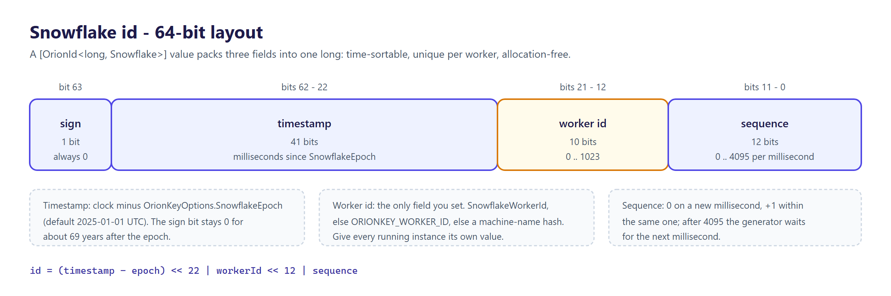

<p align="center">
  <picture>
    <source media="(prefers-color-scheme: dark)" srcset="docs/logo.png">
    
  </picture>
</p>

<h1 align="center">OrionKey</h1>

<p align="center">Source-generated strongly-typed IDs for .NET.</p>

<p align="center">
  <a href="https://github.com/tunahanaliozturk/OrionKey/actions/workflows/ci-cd.yml"></a>
  <a href="https://www.nuget.org/packages/OrionKey"></a>
  <a href="LICENSE.txt"></a>
  
</p>

OrionKey turns a `readonly partial struct` into a fully-featured strongly-typed ID with a
single attribute. A bundled Roslyn source generator emits the equality, comparison, factory,
serialization, and persistence members, so a domain ID stops being a bare `Guid` or `long`
and becomes a distinct type the compiler can check. There is no base class and no runtime
reflection: declare the struct, build, use it.

## How it works

![OrionKey overview: an [OrionId] partial struct is compiled by the bundled source generator into always-on companions (equality, comparison, parsing, System.Text.Json and TypeConverter) plus EF Core, Dapper, Newtonsoft.Json, MongoDB and Swashbuckle companions when the project references those libraries; at run time New() calls the OrionKey facade, which OrionKey.Configure and OrionKey.Testing can influence](docs/diagrams/overview.png)

## Packages

| Package | What it is |
| --- | --- |
| [`OrionKey`](https://www.nuget.org/packages/OrionKey) | The `[OrionId]` attributes, strategy markers and `OrionKey` facade, with the source generator, analyzers and code fixes bundled in the same package. |
| [`OrionKey.EntityFrameworkCore`](https://www.nuget.org/packages/OrionKey.EntityFrameworkCore) | Model-wide EF Core converter registration: `UseOrionKeyConversions()`, `ConfigureOrionKeyConversions()` and a generic `HasOrionKeyConversion<TId, TValue>()`. |
| [`OrionKey.Testing`](https://www.nuget.org/packages/OrionKey.Testing) | `DeterministicIdScope` and sequential generators for repeatable ids in tests. |

## Snowflake ids

A 64-bit Snowflake id packs three fields into a `long`: a millisecond timestamp relative to a
fixed epoch, a per-process worker id, and a per-millisecond sequence counter. The layout is
what makes Snowflake ids time-sortable, unique across instances without coordination, and free
of allocation.



Worker id is the only field that needs human attention; the timestamp comes from the clock and
the sequence is internal. Pin it with `OrionKey.Configure(o => o.SnowflakeWorkerId = N)` or
the `ORIONKEY_WORKER_ID` environment variable in every replica.


## Quick start

```shell
dotnet add package OrionKey
```

Declare an ID by marking a partial struct with `[OrionId]` and a storage type. The optional
second type argument selects a generation strategy:

```csharp
using Moongazing.OrionKey;

[OrionId<Guid>]              public readonly partial struct OrderId;
[OrionId<long, Snowflake>]   public readonly partial struct UserId;
[OrionId<string, Ulid>]      public readonly partial struct TenantId;
[OrionId<string, NanoId>]    public readonly partial struct SessionId;
```

Each struct now has a `New()` factory, value equality, parsing, and serialization:

```csharp
var id = OrderId.New();

OrderId a = OrderId.New();
OrderId b = a;
Console.WriteLine(a == b);   // true, value equality

// Works as-is with System.Text.Json
var json = JsonSerializer.Serialize(new { OrderId = id });

// Works as-is as a minimal-API route parameter
app.MapGet("/orders/{id}", (OrderId id) => /* ... */);
```

The generated `System.Text.Json` converter and `TypeConverter` are attached to the struct by
attributes, and the public `TryParse` overloads are what ASP.NET Core route binding looks for, so
reflection-based `System.Text.Json` and model binding need no registration.

EF Core is the exception: the generator emits an `<Id>ValueConverter` and a
`HasOrionKeyConversion()` property helper when the project references EF Core, but EF Core does
not pick a converter up on its own. Wire it per property, or for the whole model with the
`OrionKey.EntityFrameworkCore` package:

```csharp
protected override void OnModelCreating(ModelBuilder modelBuilder)
{
    // Per property, with the helper generated next to OrderId:
    modelBuilder.Entity<Order>().Property(o => o.Id).HasOrionKeyConversion();

    // Or every [OrionId] property at once (OrionKey.EntityFrameworkCore):
    // modelBuilder.UseOrionKeyConversions();
}
```

Analyzer `ORIONKEY006` warns when an id property of an entity has no converter configured.

## Strategies

| Declaration | Storage | New() | Sortable |
| --- | --- | --- | --- |
| `[OrionId<Guid>]` | Guid | `Guid.NewGuid()` | no |
| `[OrionId<Guid, GuidV7>]` | Guid | UUIDv7 | yes |
| `[OrionId<Guid, SequentialGuid>]` | Guid | SQL Server-ordered sequential GUID | yes |
| `[OrionId<long, Snowflake>]` | long | Snowflake | yes |
| `[OrionId<string, Ulid>]` | string | ULID | yes |
| `[OrionId<string, Ksuid>]` | string | KSUID | yes |
| `[OrionId<string, ObjectId>]` | string | MongoDB ObjectId (24-char hex) | yes |
| `[OrionId<string, MonotonicHex>]` | string | 32-char lowercase hex, time-ordered | yes |
| `[OrionId<string, NanoId>]` | string | NanoId | no |
| `[OrionId<string, Cuid2>]` | string | CUID2 | no |
| `[OrionId<int>]` / `[OrionId<long>]` | int/long | none (DB identity) | n/a |

The `int` and `long` integer forms have no `New()` factory; they model ids assigned
externally, typically by a database identity column.

### MonotonicHex

`MonotonicHex` produces a 32-character lowercase hex string built from a 48-bit millisecond
Unix timestamp (big-endian) followed by 80 bits of randomness. The big-endian layout and the
`0-9a-f` alphabet make ordinal string comparison equal chronological order, so the raw string
sorts the same way in code, in a database index, and in a hex-sorted store. Ids minted within
the same millisecond are strictly increasing within a process: the randomness block is
incremented rather than re-drawn, so a sequence is monotonic. If the clock steps backwards
(NTP correction, leap second) the previous timestamp is held so the sequence never regresses.

```csharp
[OrionId<string, MonotonicHex>] public readonly partial struct TraceId;

var a = TraceId.New();
var b = TraceId.New();

// Ordinal order equals creation order; b was minted after a.
Console.WriteLine(string.CompareOrdinal(a.Value, b.Value) < 0);   // true
```

The runtime factory is also exposed directly for code that needs a raw id without a wrapper
struct: `OrionKey.NewMonotonicHex()` returns the same 32-char lowercase hex string.

## What gets generated

For every annotated struct the generator emits, as `partial` companions:

- The struct body itself: a `Value` member, `Empty` and `IsEmpty`, a `New()` factory and
  `CreateMany(count)` (strategy-backed and `Guid` types), `WrapAll` / `UnwrapAll`, and
  value-based `IEquatable` equality with `==` / `!=`.
- An `IComparable` / `IComparable<T>` implementation with `<`, `<=`, `>`, `>=`, for every id.
  Sortable strategies (`GuidV7`, `SequentialGuid`, `Snowflake`, `Ulid`, `Ksuid`, `ObjectId`,
  `MonotonicHex`) compare in creation order; the others compare by value, which is stable but
  not chronological.
- A `System.Text.Json` `JsonConverter` so the id serializes as its underlying value.
- A `TypeConverter` for framework conversions and ASP.NET Core model binding.
- `IParsable<T>` and `ISpanParsable<T>` implementations plus public `Parse` and `TryParse`
  methods (and `ParseOrDefault` for `Guid`, `int` and `long` ids), and `IUtf8SpanFormattable` / `IUtf8SpanParsable<T>` for UTF-8 I/O.
- An EF Core `<Id>ValueConverter` and a `HasOrionKeyConversion()` property helper, emitted only
  when the project references EF Core (see [Quick start](#quick-start) for wiring them).

## Library integration

OrionKey emits additional companions automatically when the consumer project references any of these libraries. There is no extra configuration — the source generator probes the compilation and only emits what the project can use.

| Library | Generated companion | One-line registration |
| --- | --- | --- |
| System.Text.Json (source-gen) | `OrionKeyJsonConverterFactory` | `OrionKeyJsonRegistrar.AddTo(options);` |
| Dapper | `<Id>DapperTypeHandler` | `OrionKeyDapperRegistrar.Register();` |
| Newtonsoft.Json | `<Id>NewtonsoftJsonConverter` | `OrionKeyNewtonsoftJsonRegistrar.AddTo(settings);` |
| MongoDB driver | `<Id>BsonSerializer` | `OrionKeyMongoRegistrar.Register();` |
| Swashbuckle (OpenAPI) | `<Id>SchemaFilter` | `OrionKeyOpenApiRegistrar.AddTo(options);` |

Each registrar enumerates every `[OrionId]` struct in the assembly and wires it into the library's registry, so a single call covers every id you have declared.

For ordinary reflection-based `System.Text.Json` and ASP.NET Core model binding, the generated companions are found through their attributes and public `TryParse`, so no registrar call is required. EF Core converters are wired with `HasOrionKeyConversion()` or `OrionKey.EntityFrameworkCore`, as shown in [Quick start](#quick-start). The `OrionKeyJsonRegistrar.AddTo(options)` call exists for the reflection-free source-generation path: pair it with a `JsonSerializerContext` constructed over those options, as covered in [AOT & trimming](#aot--trimming) below.

### System.Text.Json source-generation

`OrionKeyJsonRegistrar.AddTo(JsonSerializerOptions)` registers every generated id converter on the supplied options in one call, backed by `OrionKeyJsonConverterFactory`, a reflection-free `JsonConverterFactory` that resolves the assembly's `[OrionId]` types through a compile-time type switch. This is the path to use with a source-generated `JsonSerializerContext`, where the per-id `[JsonConverter]` attribute is not visible to the `System.Text.Json` generator. Register the converters first, then construct the context over those same options:

```csharp
var options = new JsonSerializerOptions();
OrionKeyJsonRegistrar.AddTo(options);     // wires every [OrionId] converter, AOT-safe
var ctx = new MyJsonContext(options);     // construct the context over those options

var json = JsonSerializer.Serialize(OrderId.New(), ctx.OrderId);
var id = JsonSerializer.Deserialize(json, ctx.OrderId);
```

Constructing the context with a bare `MyJsonContext.Default` does not honor the converters, because `Default` is built over an internal options instance that never saw the `AddTo` call. Always build the context over the options you registered into. Ids still serialize as their bare scalar (string or number) shape.

## AOT & trimming

OrionKey is compatible with Native AOT (`<PublishAot>true</PublishAot>`) and trimming (`<PublishTrimmed>true</PublishTrimmed>`). All three packages (`OrionKey`, `OrionKey.Testing`, `OrionKey.EntityFrameworkCore`) carry `<IsAotCompatible>true</IsAotCompatible>`, every generated converter is reachable via attributes (no runtime reflection scan), and CI publishes and runs a self-contained AOT sample binary on `linux-x64` and `win-x64` on every push and pull request to prove the toolchain stays clean. In `OrionKey.EntityFrameworkCore`, the model-wide `UseOrionKeyConversions()` and `ConfigureOrionKeyConversions()` discover ids by reflection and are annotated `RequiresUnreferencedCode` / `RequiresDynamicCode`; under AOT use the per-property `HasOrionKeyConversion()` instead.

Three Phase B integration libraries — Newtonsoft.Json, MongoDB.Driver, and Swashbuckle.AspNetCore — are not AOT-clean as of mid-2026. Their OrionKey emitters continue to work in non-AOT projects; if your project publishes AOT, prefer `System.Text.Json`, EF Core, and the BCL `TypeConverter` / `IParsable` pipelines. See [sample/Moongazing.OrionKey.AotSample](sample/Moongazing.OrionKey.AotSample) for a working end-to-end example.

Two AOT-specific patterns the sample demonstrates:

- **`System.Text.Json` with a source-generated context.** Source generators don't see each other's emitted attributes, so the `[JsonConverter]` attribute OrionKey emits is invisible to the `System.Text.Json` source generator. Register the generated converters with `OrionKeyJsonRegistrar.AddTo(options)` at startup, then construct your `JsonSerializerContext` with those options (`new MyContext(options)`) and serialize via the context's per-type properties.
- **`IParsable<T>` in generic code.** The `IParsable<T>` / `ISpanParsable<T>` members are explicit interface implementations that forward to the public `Parse` / `TryParse` methods. Generic code calls them through a constraint, `where T : IParsable<T>`, with `T.Parse(text, null)`; non-generic code can call `MyId.Parse(text)` directly.

**Dapper note:** The OrionKey-generated `<Id>DapperTypeHandler` is AOT-compatible, but the Dapper assembly itself (2.1.35) produces aggregate `IL2104`/`IL3053` warnings during AOT publish because the Dapper team has not yet annotated it as trim-safe. AOT consumers can either suppress these per-assembly warnings (at their own risk) or wait for an upstream Dapper release that ships trim/AOT annotations. The AOT sample in this repo deliberately omits Dapper for that reason.

## Snowflake worker IDs

Snowflake ids embed a per-process **worker ID** (10 bits, 0-1023) to stay unique across
instances. Configure it explicitly with
`OrionKey.Configure(o => o.SnowflakeWorkerId = N)` or the `ORIONKEY_WORKER_ID` environment
variable; otherwise OrionKey derives one from the machine name and writes a one-time
warning. In any multi-instance deployment you should pin the worker ID explicitly. See
[docs/snowflake-worker-ids.md](docs/snowflake-worker-ids.md) for details.

## Benchmarks

A [BenchmarkDotNet](https://benchmarkdotnet.org/) suite covers raw generation per strategy
(against a `Guid.NewGuid()` baseline), the overhead of the generated wrapper, parsing, and
formatting / equality. [benchmarks.md](benchmarks.md) explains what each class measures; it
deliberately quotes no fixed figures, because they depend on your CPU and runtime. Run it
locally:

```shell
dotnet run -c Release --project benchmarks/Moongazing.OrionKey.Benchmarks
```

## Testing

The `OrionKey.Testing` package makes generated ids predictable in tests. While a
`DeterministicIdScope` is alive, the `OrionKey` facade hands out ascending, repeatable values
(1, 2, 3, ... in each strategy's shape) instead of random or time-based ones; disposing it
restores the normal generators.

```csharp
using Moongazing.OrionKey.Testing;

using (new DeterministicIdScope())
{
    var first = UserId.New();    // Snowflake: 1
    var second = UserId.New();   // Snowflake: 2
}
```

The scope covers every strategy-backed id. A plain `[OrionId<Guid>]` id calls
`Guid.NewGuid()` directly and stays random. The scope changes process-wide state, so tests
that use it must not run in parallel with each other or with other code that generates ids.
The package also ships standalone `SequentialSnowflake`, `SequentialUlid`, `SequentialNanoId`,
`SequentialCuid2`, `SequentialKsuid` and `SequentialObjectId` counters.

## Roadmap

OrionKey ships in phased minor releases on the way to 1.0:

- **`0.2.0` — New ID strategies** *(Done, 2026-05-22)* — `Cuid2`, `Ksuid`, `ObjectId`, `SequentialGuid`, plus byte-order GUID and ordinal-string `CompareTo` fixes.
- **`0.3.0` — Integration emitters** *(Done, 2026-05-23)* — conditional emitters for Dapper, Newtonsoft.Json, MongoDB, and Swashbuckle/OpenAPI, plus per-library aggregate registrars.
- **`0.3.1` — Logo refresh** *(Done, 2026-05-23)* — new minimalist family-style key logo in Moongazing indigo; no code changes.
- **`0.4.0` — Native AOT & trimming** *(Done)* — full `PublishAot`/`PublishTrimmed` compatibility with a verified AOT sample app and CI publish job.
- **`0.5.0` — Analyzer, code-fix, stabilization** *(Done, 2026-06-01)* — new diagnostics (`ORIONKEY006`–`008`), code-fix providers, source-generator performance pass.
- **`0.6.0` — Source-gen JSON path & `MonotonicHex`** *(Done, 2026-06-19)* — reflection-free `System.Text.Json` registrar (`OrionKeyJsonRegistrar.AddTo`) for the AOT source-generation path, and the sortable, monotonic `MonotonicHex` string strategy.
- **`0.7.0` — EF Core value-converter ergonomics** *(Done, 2026-07-20)* — a new `OrionKey.EntityFrameworkCore` sub-package whose `UseOrionKeyConversions()` wires the generated value converters across a whole model in one call.
- **Composite IDs & extra strategies** *(Planned)* — multi-value tuple IDs, `Tsid`/`Xid` strategies. (The `IUtf8SpanFormattable`/`IUtf8SpanParsable` emitters once planned here already shipped in `0.5.27`/`0.5.28`.)
- **`1.0.0` — Stable API** *(Planned, Q2 2027)* — public-type and emitter-contract freeze, LTS window, `net8.0` drop decision.

Full roadmap with *Considered* and *Out of scope* sections lives in
[docs/ROADMAP.md](docs/ROADMAP.md). If something on the list matters to you, open an issue
with the `roadmap` label.

## More from the Orion family

OrionKey is one of a set of standalone .NET libraries:

- [OrionGuard](https://github.com/tunahanaliozturk/OrionGuard) - guard clauses, validation, DDD primitives for .NET.
- [OrionAudit](https://github.com/tunahanaliozturk/OrionAudit) - automatic EF Core change-audit trail.
- [OrionPatch](https://github.com/tunahanaliozturk/OrionPatch) - transactional outbox primitive (enqueue inside EF Core SaveChanges, dispatch at-least-once through a pluggable sink).

### See it in a real app

[Moongazing.OrionShowcase](https://github.com/tunahanaliozturk/OrionShowcase) is a production-shaped banking sample that integrates the Orion packages end-to-end. It pins the Snowflake worker id with `OrionKey.Configure` at startup and uses the `OrionKey.NextSnowflake()` facade for audit-row ids and transaction ids. Concrete usage:

- [src/Moongazing.OrionShowcase.Infrastructure/Audit/EfAuditWriter.cs](https://github.com/tunahanaliozturk/OrionShowcase/blob/main/src/Moongazing.OrionShowcase.Infrastructure/Audit/EfAuditWriter.cs)
- [src/Moongazing.OrionShowcase.Infrastructure/Ids/OrionKeyTransactionIdGenerator.cs](https://github.com/tunahanaliozturk/OrionShowcase/blob/main/src/Moongazing.OrionShowcase.Infrastructure/Ids/OrionKeyTransactionIdGenerator.cs)

OrionKey does not ship an idempotency store. The showcase's `OrionKeyIdempotencyStore` is the
sample's own EF Core table behind its MediatR `IdempotencyBehavior`; it keys on the command's
idempotency key, not on an OrionKey-generated id.

## Contributing

Issues and pull requests welcome. Please read [CONTRIBUTING.md](CONTRIBUTING.md) and the [Code of Conduct](CODE_OF_CONDUCT.md) before opening one.

## License

OrionKey is released under the MIT License. See [LICENSE.txt](LICENSE.txt).
